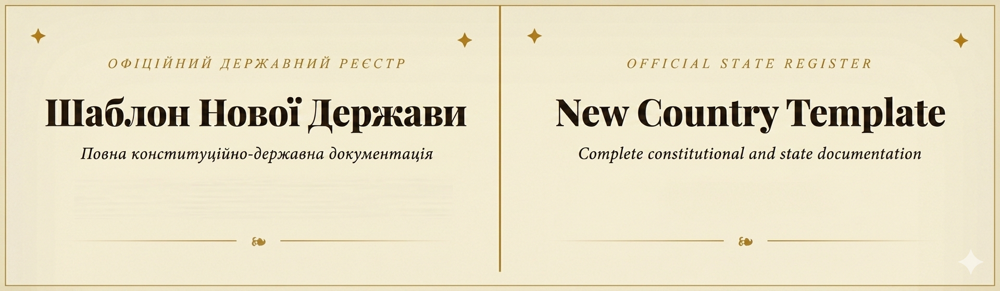

🇺🇦 Опис (UA)

🏛 **Офіційний Державний Реєстр: Шаблон Нової Держави**

Це веб-інструмент для створення детальної документації вигаданої або реальної держави у форматі офіційного реєстру.

⚙ **Поточна версія:** v0.6.1

Проєкт поєднує зручний інтерфейс зі стилізованим дизайном під державний документ і дозволяє заповнювати ключові аспекти країни:

- політичну систему та керівництво
- населення та економіку
- армію, спецслужби та безпеку
- географію, історію та зовнішню політику
- партії, суспільство та технології

Підтримується два режими роботи:
- **Простий** — для швидкого створення базового опису
- **Експерт** — для детального опрацювання всіх аспектів

### Додаткові можливості
- перемикання мови (UA / EN)
- експорт у `.txt` та `.docx`
- друк документа
- імпорт даних

### Важливі зауваження щодо функціоналу
- Експорт у **.docx** працює **некоректно** (не рекомендую використовувати зараз)
- Друк документа — **в розробці**
- Імпорт даних — **працює**, але **не повністю виправлений**

---

🇬🇧 Description (EN)

🏛 **Official State Register: New Country Template**

This is a web-based tool for creating structured documentation of a fictional or real state in the format of an official register.

⚙ **Current version:** v0.6.1

The project combines a clean interface with a document-style design, allowing users to define key aspects of a country:

- political system and leadership
- population and economy
- military, intelligence, and security
- geography, history, and foreign policy
- parties, society, and technology

Two operating modes are available:
- **Simple Mode** — for quick basic setup
- **Expert Mode** — for detailed configuration of all aspects

### Additional Features
- Language switch (UA / EN)
- Export to `.txt` and `.docx`
- Document printing
- Data import

### Important notes on functionality
- **.docx** export is **not working correctly** (not recommended to use at the moment)
- Document printing — **in development**
- Data import — **works**, but **not fully fixed**
